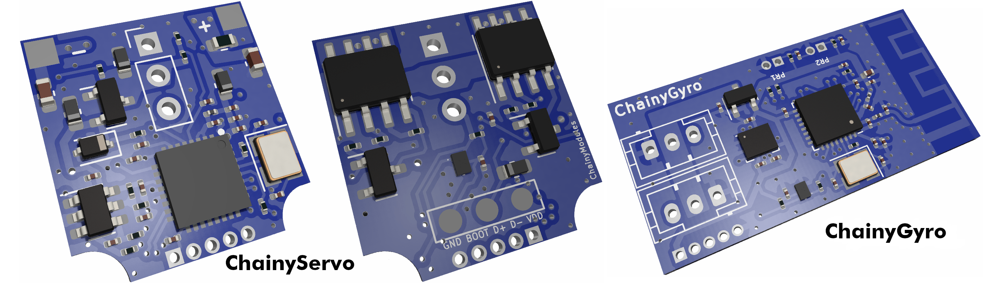

# ChainyModules
An ecosystem of electronics modules based on the ESP32-C3FH4 microcontroller capable of chained communication through half-duplex UART.

This project is made to simplify the usage of different modules in robotics projects. Based on the microcontroller ESP32-C3FH4, which is powerfull enough for most tasks, different modules can be created, all the while allowing for chained connection (daisy chaining). Simply put, you can use these modules on different parts of your robot and interconnect them all using only 3 pins, and chain them together that only 1 cable needs to go to the main board (which can be a RPI, one of the modules themselves, ...).

   

Since all the modules use the same microcontroller, the programming is really easy and the communication as well -- the modules use half-duplex UART, the full-duplex UART from the ESP32 is transformed through a dual buffer open drain outputs. The absolute maximum speed for communication is 2,250,000 baud, but its better to use a bit less (1,000,000 baud works great and should be enough for most projects). For the programming of the boards, you can use the programming board specifically designed for this purpose so you don't have to connect 5 pins to each module separatly for programming.

The microcontroller has inbuilt flash for a smaller footprint on the board, and you can use WiFi or Bluetooth with it, it also has flash for storing user variables. It can also be connected to the computer directly without the need of a converter like the CP2102 (you may need to install a driver for it though).

Here are some more parameters:
|Chainy modules|v1.0|
|---|---|
| Microcontroller | ESP32-C3FH4 |
|Supply Voltage|3,3-12V|
|Communication pins|GND, VCC, TX|
|Maximum chained modules (limited by program only)|255|
|Broadcast ID|255|
|Currently designed modules|2|

### Instructions for using already existing modules
The already existing modules have their KiCAD schematic files in the Electronics/ folder. KiCAD 7.0.1 or newer is required, simply open the project and you should be able to plot the gerber files without having to modify anything.

The program is in the folder Software/ and is pretty simple. The basics for each module are the same and are in main.cpp. Every module has to be able to respond to the same basic commands (see table below). Specific modules then have different libraries with code to function. These libraries implement further commands, which have therefore preemptively been be added to the main.cpp switch statement.

|Command|cmd num|
|---|---|
|Set ID|1|
|Read type|2|
|Deepsleep*|3|

*Deepsleep is a command I implemented here because you can (and I did in one of my projects) use the power cables to also charge the robot when not running. Of course, this powers on the modules, so a module recognizes the charging (in my project that was simply using an LED and a photoresistor) and sends this command to the broadcasting address 255, so all the modules turn off. They then consume roughly 5 microamps so it doesn't slow down the charging nearly as much.

### Instructions for the custom servomotors
I created a custom servomotor capable of adressing and reading position, based on the MG90 servomotor. It uses the ChainyServo module board together with the two extension boards located inside the ChainyServo electronics folder. Using the picture in the ChainyServo Electronics folder, you can see how to assemble it. The STL and SLDPRT files are in the Mechanics/ folder. For the gears, motor and potentiometer, you can buy an MG90 (SG90 should work as well) servo and dissassemble it. When soldering the motor to the extension board, be careful that the dot on the plastic bottom of the motor has to align with the white arrow on the board, or the servo will rotate the other way and you will have to change the program. Also, beware that the motor can run on only about 5V, don't burn it - adjust the max pwm output accordingly!

I had my mechanical parts printed at JLCPCB with the material PA12.

#### Troubleshooting the servomotor
If the motor isn't spinning at all, most likely the mechanics is binding somewhere. Try to disassemble to servo and spin the gears manually a bit to see if you can find the problem.
If the motor spins but is going the wrong direction and won't stop jiggling, remove the biggest gear and flip it 180 degrees, which should fix the probelm (it can be inserted into the potentiometer in two ways but only one is correct).

### Instructions for creating a custom module
If you want to create a custom module to go with this repository, you are more than welcome to do so; and if you want send me the files and I can add them here, referencing you (pr not if you don't want me to).

To create a module that will be compatible, you have to mind these things the most:

|Dont't forget this|in your module|
|---|---|
| Microcontroller | ESP32-C3FH4 |
|Supply Voltage|3,3-12V*|
|Communication pins|GND, VCC, TX|
|Connectors|2x JST-PH|
|Programming pins (2mm connector)|VCC D+ D- BOOT GND**|
|Half duplex UART|at least 115 200 baud (ideally just use the buffer I have in my designs)|

*The range can be less if you want, but not more (or else you cannot use the modules already created). Ideally just use a regulator like the one in my modules.
** Or you can put a USB-C connector on the module but that's way too bulky and expensive for my liking.

Other than that, design what you like. You don't have to use my modules at all, as they probably don't fit your needs but that is fine --  the whole point of this project is to provide guidance on how to make such chained modules and to have some code and electronics done for it already, and over time hopefully create a whle ecosystem of these modules so that anyone can se what others have already designed and pick what souits them best. Have fun making, makers!